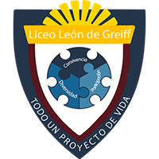

# IE Liceo León de Greiff 
Repositorio para el Proyecto piloto de la pagina institucional para la IE Liceo León de Greiff acorde a las necesidades de la entidad.

  

# 📖 Documentación – **llg-project**

> Manual vivo del Sistema de Gestión Institucional del **Liceo León de Greiff**.

Versión 0.0.0 • Última actualización: 2025-06-20

---

## 🗂️ Navegación Rápida

| Sección | Descripción |
|---------|-------------|
| 🎨 **[Guía de Estilo](guia-estilos)** | Paleta de colores, tipografías y componentes. |
| 👀 **[Mockup](mockup)** | Vistazo visual al diseño de la plataforma. |
| 🛠️ **[Desarrollo](desarrollo)** | Pasos de instalación, comandos, Nginx, roles y más. |
| ✨ **[Acerca de](acerca-de)** | Información del proyecto, equipo y roadmap. |

---

Sugerencias bienvenidas en la sección Discussions 🙌

